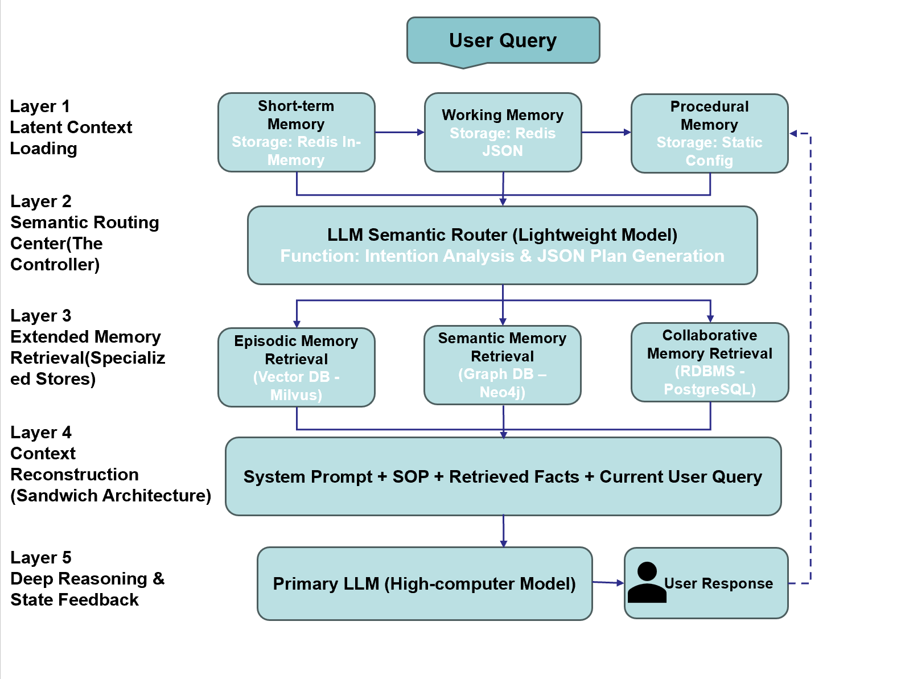

<div align="center">
  
  <h1>Feishu-nanobot</h1>
  <h3>专为飞书定制的增强记忆型个人AI智能体</h3>
</div>

> ⚠️ **项目声明**
> 
> 本项目是基于开源项目 [nanobot (HKUDS/nanobot)](https://github.com/HKUDS/nanobot) 进行的二次开发。
> 
> 我们保留了原版极致轻量的核心特性，并主要针对原项目的 **记忆力模块 (Memory Module)** 进行了深度改造与重构，以实现更强大的长期记忆、情景关联以及更深度的飞书生态集成。
> 
> **注：本项目目前仍在积极开发中 (Work in Progress)。** 衷心感谢原作者团队提供的优秀底层框架！

---

### 📋 开发更新日志

| 日期 | 更新内容 |
|------|---------|
| 2026.4.19 | ✅ 初步完成短期记忆模块的开发；✅ 完成基于LightRAG的语义记忆模块的开发；|
| 2026.4.17 | ✅ 完成记忆模块与Nanobot原项目接口的开发 |

---

## 🧠 Agent 工作流与人类记忆类比 (Agent Workflow & Human Memory Analogy)

Agent 的记忆系统模拟了人类记忆的形成过程，整个生命周期可分为以下五个关键阶段：

1. **编码 (Encoding)** 
   - 将感知到的原始信息（用户消息、API响应、执行结果）转换为结构化的、可处理的形式
   - 在我们的系统中，短期记忆模块负责这一阶段的工作

2. **存储 (Storage)**
   - 将编码后的信息保存在合适的存储介质中
   - 不同类型的记忆采用不同的存储策略：短期使用高速内存(Redis)、长期使用向量库和图数据库

3. **检索 (Retrieval)**
   - 根据当前任务需要，从记忆系统中提取相关信息
   - 通过 LLM 路由器进行智能意图识别，采用混合检索策略实现精准召回

4. **整合 (Consolidation)**
   - 将短期记忆逐步转化为长期记忆，提炼核心信息并形成可复用的知识
   - 后台异步任务定期将情景记忆蒸馏成语义记忆，沉淀为知识图谱

5. **遗忘 (Forgetting)**
   - 删除不重要、过时或冗余的信息，防止记忆系统膨胀和冲突
   - 采用时间衰减、访问频率、重要性评分等多维度机制管理记忆生命周期

## 🏗️ 记忆模块架构设计 (Architecture)

我们在原有框架的基础上，定义并设计了全新的、更复杂的记忆模块。以下是 Feishu-nanobot 的记忆模块架构图：

<p align="center">
  
</p>


### 记忆模块核心组件说明：

**Short-Term Memory (STM) / 短期记忆**：采用滑动窗口机制（Sliding Window），高效处理并保留近期的传感器数据流与记忆片段。

**Working Memory (WM) / 工作记忆**：结合结构化模板（Structured Templates）与原始文本，支持面向具体任务的快速记忆检索。

**Episodic & Scenario Memory / 情景与场景记忆**：引入图检索增强生成（Graph RAG）技术，并结合时间动态机制（包含时间戳、记忆衰减、重新激活和权重调整），实现复杂信息的长期存储与网状关联。

**Memory Integration & Context Processing / 记忆整合与上下文处理**：通过显式模板提示（Explicit Template）或调用轻量级本地小模型（Small LLM）生成快速摘要，将多维度的记忆进行完美融合，最终输入给主控大语言模型（Main LLM Model）执行决策和动作。

您可以参考[记忆设计](docs/mds/design.md)，来研究我们在nanobot上做的最特别的改动。

---

## 🚀 快速开始 (Quick Start)

### Install from Source (目前只支持这种方式)
- WSL / Linux
```bash
git clone https://github.com/pan-siqi/Feishu-Nanobot.git
uv sync # or python -m venv .venv && pip instal -e .
```

### Environment Config
在`envs`文件夹下，可以找到`envs/nanobot_config.json`以及`envs/lightrag.env`文件，分别对应nanobot和LightRAG的配置文件，为了便于管理LLM API，实际上LightRAG接入的是nanobot的provider，因此lightrag.env中关于LLM配置的部分是不生效的；

由于时间限制，目前仍然未能完成环境的统一配置入口。

---

## 📖 使用指南 (Usage)
### 一、创建Feishu机器人：

访问[飞书开放平台](http://open.feishu.cn/app)，创建一个新应用，启用机器人（Bot）能力。

**开启权限：**
1. `im:message`（发送消息）
2. `im:message.p2p_msg:readonly`（接收消息）

**流式回复（nanobot 默认开启）：**

需要添加`cardkit:card:write`，该权限用于 CardKit 实体和助手的流式文本输出，旧应用可能暂时没有该权限 —— 请在「权限管理」中启用该权限，如控制台要求则发布新版本应用。如果无法添加`cardkit:card:write`，可以在 `channels.feishu` 下设置 `"streaming": false`（见下文配置）。机器人仍可正常工作，但回复将使用普通交互卡片，而不是逐字流式输出

**事件订阅：** 添加`im.message.receive_v1`（用于接收消息）

**连接方式：** 选择“长连接模式”（需要先运行 nanobot 以建立连接）

**获取凭证：** 在「凭证与基础信息」中获取 App ID 和 App Secret

**最后：** 发布应用

### 二、使用如下指令启动nanobot后台：
```bash
nanobot gateway --workspace ./.nanobot_workspace \
--config ./envs/nanobot_config.json \
--verbose
```
如果您想使用`Neo4j`管理知识图谱，请参考[Neo4j下载](https://neo4j.com/docs/operations-manual/current/installation/)下载本地的Neo4j平台，然后使用
```bash
neo4j console
```
启动控制台。对于WSL用户，可以安装windows版本的Neo4j，然后通过修改config的方式在WSL访问Windows端的Neo4j。

---

## 👥 贡献者（Contributors）


---

## 🔗 相关资源 (Related Resources)

- 原项目：[HKUDS/nanobot](https://github.com/HKUDS/nanobot)
- 飞书开放平台：[Feishu Open Platform](https://open.feishu.cn/)
- LightRAG：[轻量级图检索增强生成](https://github.com/HKUDS/LightRAG)
