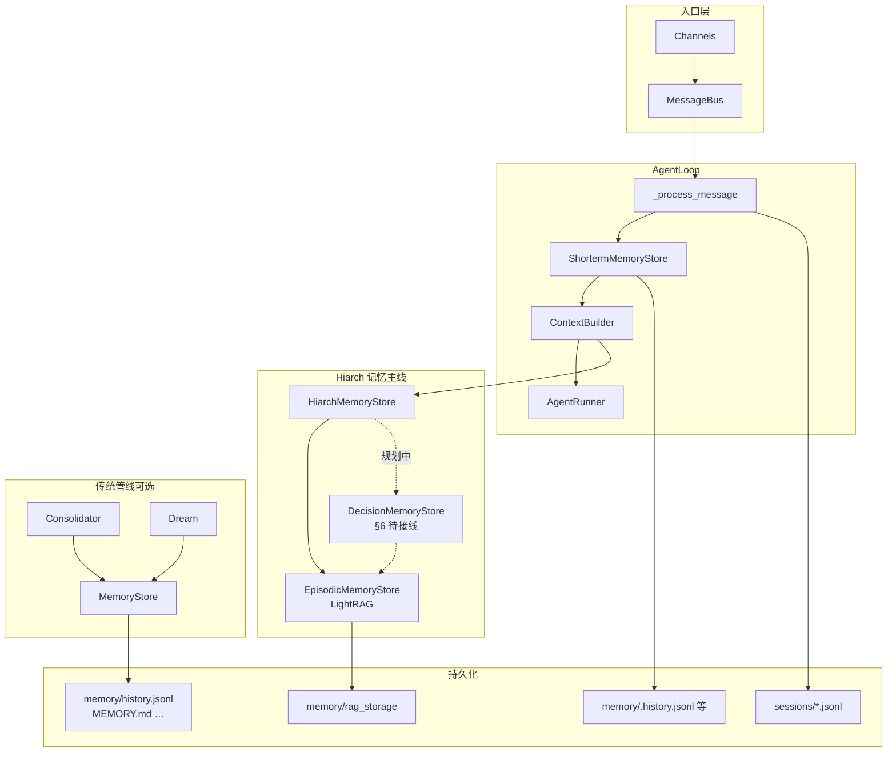
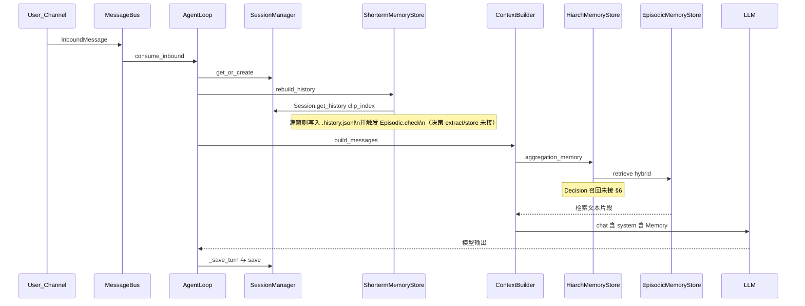
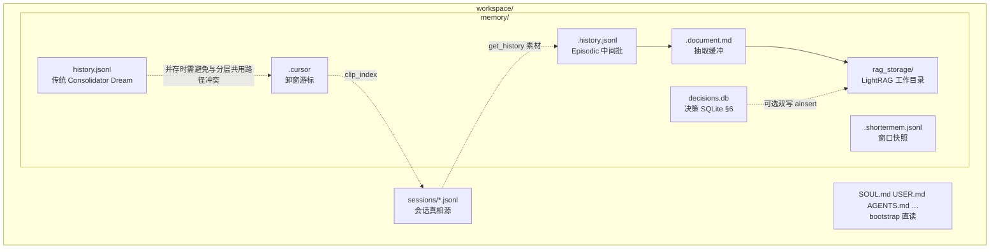

# 本项目 Memory 全链路说明

本文从**对话与数据如何进入系统**、**如何落盘**、**如何在后续轮次被读回并注入提示词**三个维度，梳理解析仓库内与 *memory* 相关的实现，并给出**函数级调用关系**。项目里同时存在**传统 nanobot 文件层（`MemoryStore` + `Consolidator` + `Dream`）**与**本 fork 的分层记忆改造（`HiarchMemoryStore` + `ShortermMemoryStore` + `EpisodicMemoryStore`）**两套逻辑；运行时主路径以后者为主，前者多为保留代码或通过 Cron/命令间接引用，接线状态见文末「集成现状」（§9）。

另：**结构化决策层 `DecisionMemoryStore`**（`nanobot/agent/hiarch_memory/decision.py`）已实现 **`extract()` / `store()`** 与 SQLite + 可选 LightRAG 双写，但**尚未接入** `AgentLoop`、`ContextBuilder`、`HiarchMemoryStore.aggregation_memory` 或 `ShortermMemoryStore.rebuild_history` —— 详见 **§6**。

---

## 1. 架构总览

| 层级 | 组件 | 职责简述 |
|------|------|----------|
| 会话真相源 | `Session` / `SessionManager` | 每条渠道的对话以 JSONL 形式保存在 `workspace/sessions/` |
| 短期滑动窗口 | `ShortermMemoryStore` | 从会话中取「近期 + 带 clip 的」历史；过长时把早段批量写入 `memory/.history.jsonl` 并推进游标；写 `.shortermem.jsonl` 快照；在适当时机触发情景层建库 |
| 长期情景检索 | `EpisodicMemoryStore` + LightRAG | 从 `.history.jsonl` 经 LLM 抽结构化单元 → 写入图 RAG → 按当前用户句做 hybrid 检索 |
| 结构化决策（模块已实现） | `DecisionMemoryStore` | `extract(messages)` → LLM 结构化抽取；`store(decisions)` → **`memory/decisions.db`** + 可选 **`EpisodicMemoryStore._rag.ainsert`**；**未接线主链路** |
| 上下文聚合入口 | `HiarchMemoryStore` | `aggregation_memory(current_message)`：当前仅调用情景检索，**尚未路由决策召回** |
| 提示拼装 | `ContextBuilder` | `build_system_prompt`（含 memory）+ `build_messages`（system + history + 本轮 user） |
| 引擎 | `AgentLoop` | 消费 bus、调用 `rebuild_history` → `build_messages` → `AgentRunner.run` |
| 传统管线（可选/部分禁用） | `MemoryStore`、`Consolidator`、`Dream` | `history.jsonl`（无点前缀）、摘要归档、定时 Dream 改 `MEMORY.md`/`SOUL.md`/`USER.md` |

**重要**：情景管线使用的中间文件是 **`memory/.history.jsonl`**（点前缀），与传统 **`memory/history.jsonl`** 不是同一文件。

### 1.1 图示结构

下列示意图与上文表格一致：**主路径**为 Hiarch（STM → Episodic）；**传统管线**为并列分支，当前在 `AgentLoop` 里多为注释或未接线（详见 §8）。下图在 GitHub、VS Code、Obsidian 等支持 Mermaid 的编辑器中可直接渲染。

#### 组件分层（运行时主线 vs 传统层）



#### 单轮请求数据流（简化时序）



#### Workspace 内记忆相关文件关系



---

## 2. 对话与数据来源

1. **各 Channel**（飞书、Telegram、CLI 等）把用户消息封装为 `InboundMessage`，经 `MessageBus` 投递。
2. **`AgentLoop.run`** 从 bus 取消息 → **`AgentLoop._dispatch`**（按 session 串行加锁）→ **`AgentLoop._process_message`**。
3. **会话持久化**：用户输入在处理早期可写入 `session`（例如普通消息路径里 `session.add_message("user", ...)`），回合结束后 **`AgentLoop._save_turn`** 把本轮新增 assistant/tool/user 追加到 `session.messages`，最后 **`SessionManager.save`** 写入 `sessions/<safe_key>.jsonl`。

因此，**记忆的「原材料」主要来自 `Session.messages`**（外加媒体经 `extract_documents` 处理后的文本）。

---

## 3. 主链路：从入站到 LLM（函数级）

以下为**当前默认主路径**（非 `channel == "system"` 的普通消息；`system` 分支类似，但 `rebuild_history` 使用同步写法，见源码）。

```
AgentLoop._dispatch(msg)
  → AgentLoop._process_message(msg, ...)
       → SessionManager.get_or_create(key)          # session/manager.py
       → AutoCompact.prepare_session(session, key) # autocompact.py（摘要注入 runtime）
       → CommandRouter.dispatch(...)               # 若为指令则提前返回
       → ShortermMemoryStore.rebuild_history(session)   # async，见 §4
       → ContextBuilder.build_messages(
             history=..., current_message=..., ...)
              → ContextBuilder.build_system_prompt(history, current_message, ...)
                   → HiarchMemoryStore.aggregation_memory(current_message)  # §5 / §7（决策层未接）
                   → SkillsLoader ...
              → merge system + history + user/runtime
       → AgentLoop._run_agent_loop(initial_messages, ...)
              → AgentRunner.run(AgentRunSpec(...))   # runner.py
       → AgentLoop._save_turn(session, all_msgs, skip)
       → SessionManager.save(session)
```

### 3.1 `ContextBuilder.build_messages`（memory 注入点）

文件：`nanobot/agent/context.py`。

- **`build_messages`**：先构造 runtime 块（`_build_runtime_context`），与用户内容合并；首条 **system** 来自 **`await build_system_prompt(...)`**。
- **`build_system_prompt`**（异步）：
  - `_get_identity`、` _load_bootstrap_files`（`AGENTS.md`、`SOUL.md`、`USER.md`、`TOOLS.md`）
  - **`memory = await self.memory.aggregation_memory(current_message)`**
  - 若 `memory` 非空 **且** `self.memory.efficient()` 为真，追加 `# Memory` 段落
  - skills 段落等

要点：**bootstrap 里的 `SOUL.md` / `USER.md` 是 Workspace 静态文件直读**；与 **Dream 自动维护同名文件** 的传统设计并存——若启用 Dream，两者应对齐为同一文件路径。

### 3.2 `efficient()` 闸门

`HiarchMemoryStore.efficient()` → `EpisodicMemoryStore.can_retrieve()`：仅当 **`memory/rag_storage` 目录已存在** 时才把检索结果写入 system prompt，避免 LightRAG 未初始化时注入空检索或无谓逻辑。

---

## 4. 短期记忆：`ShortermMemoryStore`

文件：`nanobot/agent/hiarch_memory/shorterm.py`。

### 4.1 入口

- **`async def rebuild_history(self, session: Session)`**

### 4.2 函数级展开

```
rebuild_history(session)
  → Session.get_history(max_messages=0, clip_index=self._cursor)
       # session/manager.py：从 messages[clip_index:] 取「合法尾部」对话
  → 若 len(history) >= _max_history_num (1000):
        _get_num(history)        # 计算要「卸到长期管道」的条数，并 _save_cursor()
        _save_history(history[0:_num])   # 追加写入 memory/.history.jsonl
        history = history[_num:]       # 留在窗口内的尾部
  → 若 memory/.history.jsonl 存在且 _load_history() 非空:
        await EpisodicMemoryStore.check()
  → _cleanup_history()             # 删除 memory/.history.jsonl（本轮处理完后清文件）
  → _save_shorterm_memory(history) # 写入 memory/.shortermem.jsonl（全量覆盖）
  → return history                 # 供 LLM 当条消息历史
```

### 4.3 存储文件

| 路径 | 作用 |
|------|------|
| `memory/.cursor` | 会话**在 session.messages 数组中的游标**：已「卸出」到中间档的前缀长度（按消息条数语义，与 `Session.get_history(..., clip_index=)` 配合） |
| `memory/.history.jsonl` | **临时批量**：窗口爆满时卸载的较早消息（JSON 对象列表，与 session 条目结构一致）；供下一环节 `EpisodicMemoryStore`  ingest；在本轮 `check()` 后被 `_cleanup_history` **删除** |
| `memory/.shortermem.jsonl` | 当前重建后的短期窗口快照（调试/旁路用途为主） |

---

## 5. 情景记忆：`EpisodicMemoryStore`（LightRAG）

文件：`nanobot/agent/hiarch_memory/episodic.py`。

### 5.1 写入路径（索引构建）

由 **`ShortermMemoryStore.rebuild_history`** 在适当时机调用：

```
EpisodicMemoryStore.check()
  → 若未初始化：initial_lightrag()
       → LocalModelEmbed（路径 ./model/bge-small-zh-v1.5/）
       → LightRAG(..., graph_storage="Neo4JStorage", ...)
       → await self._rag.initialize_storages()
  → await _jsonline_to_document()
       → _load_history()              # 读 memory/.history.jsonl
       → _format_messages(history)
       → OpenAICompatProvider.chat_scheme(..., scheme=InterMediateResult)
            # 模板 nanobot/templates/custom/extract.md
       → _intermediate_to_document(parsed)
            → render_template(custom/memunit.md) 拼文档块
            → _write_document → memory/.document.md
       → await self._rag.ainsert(memunit)
```

### 5.2 读取路径（检索）

由 **`HiarchMemoryStore.aggregation_memory`** 调用：

```
HiarchMemoryStore.aggregation_memory(current_message)
  → await EpisodicMemoryStore.retrieve(current_message)
       → （若已 initial_lightrag）await self._rag.aquery(query, param=QueryParam(mode="hybrid"))
  → 返回字符串拼入 system prompt
```

若 **`initial_lightrag` 从未成功执行**（`_rag` 不存在），`retrieve` 返回空串。

### 5.3 存储目录

| 路径 | 作用 |
|------|------|
| `memory/rag_storage/` | LightRAG 工作目录；**`can_retrieve()`** 即检测此路径是否存在 |
| `memory/.document.md` | 中间生成的文档文本（memunit 拼接） |

### 5.4 依赖说明（运维向）

- 嵌入：**本地** `bge-small-zh-v1.5`。
- LLM：`volcengine_openai_complete`（LightRAG 内部）、结构化抽取走 **`OpenAICompatProvider.chat_scheme`**。
- 图存储：配置为 **`Neo4JStorage`** —— 需 Neo4j 可用，否则初始化会失败（具体行为取决于 LightRAG 与运行时环境）。

---

## 6. 结构化决策记忆：`DecisionMemoryStore`（Sprint 1）

文件：`nanobot/agent/hiarch_memory/decision.py`。模板：`nanobot/templates/custom/decision_extract.md`。

### 6.1 是否已接入「整条 memory 主链路」？

**否。** 当前仅为**可复用模块**：由 `hiarch_memory/__init__.py` 导出 **`Decision`** / **`DecisionExtractItem`** / **`DecisionMemoryStore`**，但 **`AgentLoop`、`ContextBuilder`、`HiarchMemoryStore`、`ShortermMemoryStore` 中无任何引用**。  
因此：**对话不会因为跑了一轮 Agent 就自动抽决策、落库或注入 system prompt**；集成需在后续把 **`extract`/`store` 挂到卸批路径**、把 **`recall`/`list_by_project` 挂到 `aggregation_memory`**（见 proposal Router）。

### 6.2 API 与数据落点

| 方法 | 作用 |
|------|------|
| **`extract(messages, project=...)`** | 将会话格式化为文本 → 拼接 **decision_extract** 说明 → **`OpenAICompatProvider.set_scheme(DecisionExtractResult)`** → **`chat_scheme`** → 过滤 **`importance < 0.3`** → 返回 **`list[Decision]`**（**不落盘**） |
| **`store(decisions)`** | **`INSERT OR REPLACE`** 写入 **`{workspace}/memory/decisions.db`**；若构造时传入 **`episodic`** 且存在 **`episodic._rag`**，则对每个决策 **`await _rag.ainsert(_decision_to_rag_document(d))`**（与 Episodic **共用同一 LightRAG 实例**时即 proposal 中的双写） |
| **`get` / `list_by_project`** | SQLite 读取，供 CLI / 召回 / 测试 |

### 6.3 设计接线点（实现集成时要改的文件）

以下与 **proposal Sprint 1/2** 一致，便于对照开发：

1. **写入**：在 **`ShortermMemoryStore.rebuild_history`** 中，当执行 **`_save_history(history[0:_num])`**（卸下一批消息）之后，可对**同一批 message 列表**调用 **`await decision_store.extract(batch, project=session.key)`** → **`await decision_store.store(...)`**。  
   - 注意与 **`EpisodicMemoryStore.check()`** 的调用顺序、LLM 次数与失败的降级策略（可后置）。  
2. **构造实例**：在 **`AgentLoop.__init__`**（或集中工厂）中创建 **`DecisionMemoryStore(workspace, provider, model, episodic=self.episodic_memorystore)`**，并传入 **`ShortermMemoryStore`** 或挂在 **`ContextBuilder`** 依赖注入。  
3. **读出**：扩展 **`HiarchMemoryStore.aggregation_memory`**：增加 Router（或 Sprint 1 简版：拼接 **`list_by_project`** 摘要），并扩展 **`efficient()`**，避免「仅有 `decisions.db` 却无 `rag_storage`」时永远不注入 Memory。

### 6.4 函数级展开（模块内部）

```
DecisionMemoryStore.extract(messages, project=)
  → _format_messages(messages)
  → render_template("custom/decision_extract.md") + 文本 → user 消息
  → provider.set_scheme(DecisionExtractResult)
  → await provider.chat_scheme(...)
  → 若返回 LLMResponse（错误）→ []
  → 解析 result → DecisionExtractItem → 过滤 importance → 生成 Decision(id, …)

DecisionMemoryStore.store(decisions)
  → 对每个 Decision: _upsert_sqlite
  → 若 episodic._rag 存在: await _rag.ainsert(决策 canonical 文本块)
```

---

## 7. 分层聚合：`HiarchMemoryStore`

文件：`nanobot/agent/hiarch_memory/memory.py`。

- 当前 **`aggregation_memory`** 仅调用 **`_episodic_memorystore.retrieve`**；文件中 import 的 **`SemanticMemoryStore` / `WorkingMemoryStore` / `ShortermMemoryStore` 未在此类中使用**。
- **`semantic.py` / `working.py` / `base.py`** 为 **占位/省略号桩代码**（`...`），未接入主流程。

---

## 8. 传统层：`MemoryStore` / `Consolidator` / `Dream`

文件：`nanobot/agent/memory.py`。这套与上游 nanobot 对齐：**无点前缀的 `history.jsonl`**、**`MEMORY.md` 长期事实**、**Dream 两阶段改文件**。

### 8.1 `MemoryStore`（纯文件 I/O）

- **`append_history(entry)`**：写 **`memory/history.jsonl`**，更新 **`memory/.cursor`**（与 Shorterm 的 `.cursor` **同名不同语义需注意：二者都在 `memory/` 下，但传统层与分层改造共用目录时可能冲突——当前 Shorterm 也用 `memory/.cursor`，实为严重路径冲突风险**）。
- **`read_memory` / `get_memory_context`**：`MEMORY.md` → 注入长期记忆段落（供旧版 `ContextBuilder` 使用）。
- **`read_unprocessed_history` / `get_last_dream_cursor` / `set_last_dream_cursor`**：Dream 增量处理。
- **`GitStore`**：`SOUL.md`、`USER.md`、`memory/MEMORY.md` 版本管理。

### 8.2 `Consolidator`（token 压力下摘要进 `history.jsonl`）

- **`maybe_consolidate_by_tokens(session)`**：估算 prompt token，超限则 **`archive(chunk)`** → LLM 摘要 → **`store.append_history(summary)`**。
- **`archive`**：模板 **`agent/consolidator_archive.md`**。

在 **`AgentLoop` 中相关调用已全部注释**，且 **`AutoCompact(..., consolidator=None)`**。若将来恢复 `Consolidator`，需解决与 **`memory/.cursor`** 写入者的路径冲突问题。

### 8.3 `Dream`（定时把 `history.jsonl` 消化进三文件并可建 skill）

- **`Dream.run()`**：
  - **`read_unprocessed_history`** → Phase1 **`chat_with_retry`**（`dream_phase1.md`）→ Phase2 **`AgentRunner`**（`dream_phase2.md`，工具：`read_file` / `edit_file` / `write_file` under skills）。
  - **`set_last_dream_cursor`**、**`compact_history`**，可选 **`git.auto_commit`**。

触发方式设计上包括：

- **`nanobot/cli/commands.py`** 网关启动时注册 Cron **`dream`** job，`on_cron_job` 内 **`await agent.dream.run()`**。
- **`nanobot/command/builtin.py`** **`/dream`**：`await loop.dream.run()`。

---

## 9. 集成现状与不一致（便于维护）

以下依据当前仓库静态代码，便于对照排查：

| 现象 | 说明 |
|------|------|
| **`AgentLoop` 未实例化 `Dream` / `Consolidator`** | `loop.py` 中 **`self.dream`**、**`self.consolidator`** 构造被注释；**`AutoCompact(..., consolidator=None)`**。 |
| **Cron 仍调用 `agent.dream.run()`** | `cli/commands.py` 中 `job.name == "dream"` 分支仍存在 → 若未来运行网关且未恢复 `agent.dream`，会在该任务触发时报错。 |
| **`/dream`、`/status`、`/new` 等命令** | `builtin.py` 使用 **`loop.dream`**、**`loop.consolidator`**；与当前 `AgentLoop` 不同步时需一并修复或改为新记忆 API。 |
| **`DecisionMemoryStore` 未接主链路** | 见 **§6**：`extract`/`store` 未在 `loop` / `shorterm` / `HiarchMemoryStore` 中调用；`decisions.db` 仅由单测或将来 CLI 写入。 |

---

## 10. 文件路径速查

| 路径 | 归属子系统 |
|------|------------|
| `sessions/*.jsonl` | 会话主存 |
| `memory/.history.jsonl` | Shorterm → Episodic 的中间批（用完即删） |
| `memory/.shortermem.jsonl` | 短期窗口快照 |
| `memory/rag_storage/` | LightRAG |
| `memory/.document.md` | 结构化抽取后的文档缓冲 |
| `memory/decisions.db` | 决策层 SQLite（`DecisionMemoryStore`），与主链路接线见 §6 |
| `memory/history.jsonl` | 传统 Consolidator / Dream（非点前缀） |
| `memory/MEMORY.md`、`SOUL.md`、`USER.md`（根目录） | 传统长期与身份；bootstrap 直接读 workspace 根下文件 |

---

## 11. 小结

- **在线一轮对话**：数据从 **Channel → Bus → `AgentLoop._process_message`**，会话进 **`sessions/`**；**短期窗口**由 **`ShortermMemoryStore.rebuild_history`** 从 **`Session.get_history(..., clip_index)`** 取得，必要时卸载到 **`memory/.history.jsonl`** 并触发 **`EpisodicMemoryStore.check`** 更新 LightRAG。
- **记忆注入模型**：**`ContextBuilder.build_system_prompt`** → **`HiarchMemoryStore.aggregation_memory`** → **`EpisodicMemoryStore.retrieve`**（hybrid）；仅当 **`rag_storage` 存在** 时通过 **`efficient()`** 写入 `# Memory`。**决策记忆**（§6）尚未并入该路径。
- **结构化决策模块**：**`DecisionMemoryStore`** 提供 **`extract` / `store`** 与 **`memory/decisions.db`**，可选向 **`episodic._rag`** 双写；**需在代码中显式接线**后才参与运行时记忆。
- **传统 Dream/Consolidator/MemoryStore** 仍在仓库中完整实现，但与 **`AgentLoop` 当前构造**及 **Cron/内置命令** 的接线需统一，并注意 **`memory/.cursor`** 的路径共用问题。
